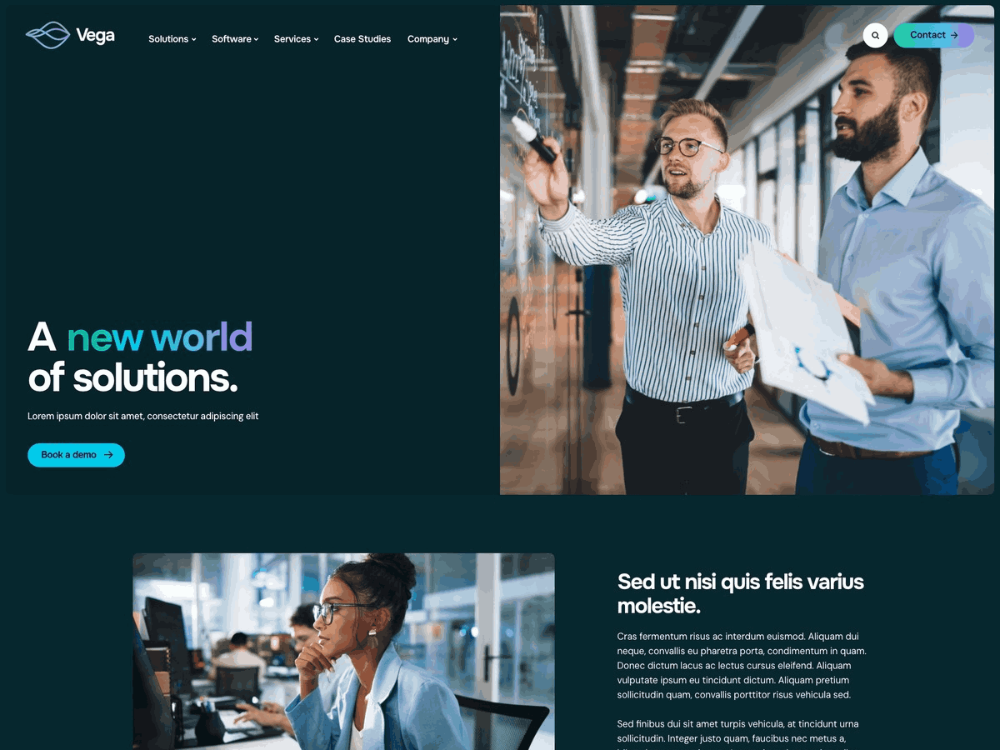

# Laser Red - Vega Front-end Test



## About The Project

This project was developed as a **Gutenberg WordPress front-end technical test for Laser Red** ([laser.red](https://laser.red)).

## Why Not Directly in Gutenberg?

Every system should first be developed in isolation before being implemented in the WordPress backend to minimize mistakes, reduce friction, and avoid unnecessary rework.

A system that can power an entire website starts with modularity. Once a modular front-end foundation is built, integrating it into WordPress is mostly a matter of connecting React props to Gutenberg attributes.
If the props are designed incorrectly or inconsistently, implementing them in the backend becomes inefficient and error-prone — resulting in wasted time and duplicated effort.

The focus of this project is to build a scalable and modular system that can be seamlessly integrated into WordPress with Gutenberg. Unlike a standard React application, the structure needs to be well-separated and carefully composed to function correctly as independent Gutenberg blocks. The placement of `<div>` elements and the organization of styles play a crucial role in ensuring proper structure, maintainability, and theme compatibility.

> **Note:** While the project is built in **Next.js** for convenience, no Next.js-specific functions are used for Gutenberg integration. For example, a custom `<Image>` component is used instead of Next.js’s `<Image>` because Gutenberg does not support it. I personally prefer building in Next.js for development speed, but the code is structured so it can be easily translated into Gutenberg blocks.

## Project Details

Test files can be found in the root folder ["/source"](https://github.com/AurelianSpodarec/laser-vega-front-end/tree/main/source).

Some minor design details have been adjusted due to the nature and constraints of technical tests in general.

Without the opportunity to clarify certain aspects with a designer, I made reasonable assumptions on spacing and layout to keep the project functional and coherent.

**Example:**  
Section **spacing values** (top/bottom) in the design included 120px, 115px, 105px, and 95px. Ideally, a system would be defined to simplify this. For maintainability, 115px and 120px could be merged into 120px, and 105px and 95px into 100px. The visual difference is subtle and barely noticeable, but it makes the codebase much more consistent, maintainable, and efficient.

## Getting Started

Follow these steps to set up the project locally.

### Prerequisites

- [PNPM](https://pnpm.io/) installed globally

```bash
pnpm install -g pnpm
```

### Installation

1. Clone the repository:

```bash
git clone git@github.com:AurelianSpodarec/laser-vega-front-end.git
```

2. Install project dependencies:

```bash
pnpm install
```

### Run the Development Server

```bash
pnpm run dev
```

The project will be available at `http://localhost:3000` (or the port specified by your setup).
